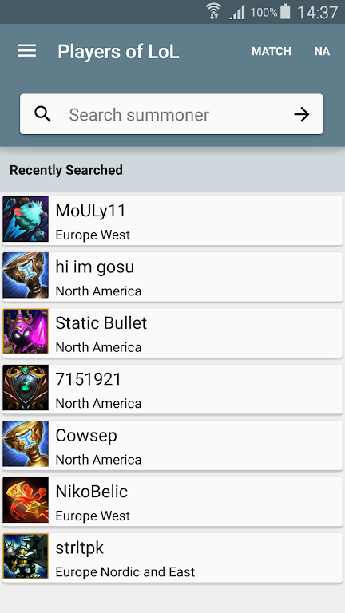
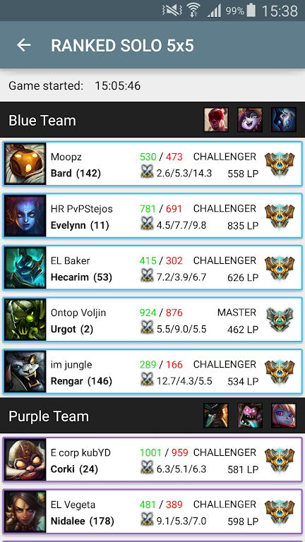
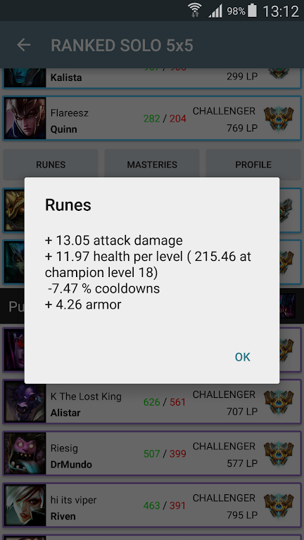
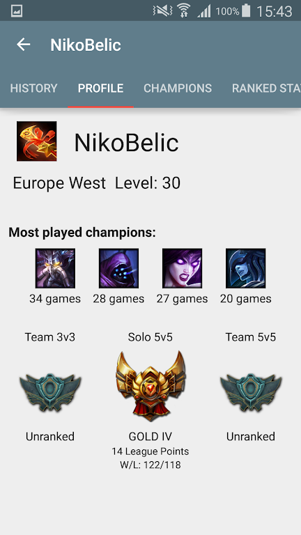
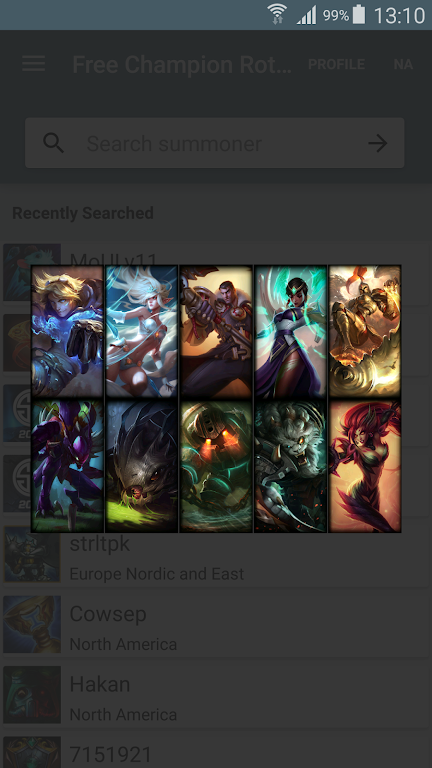
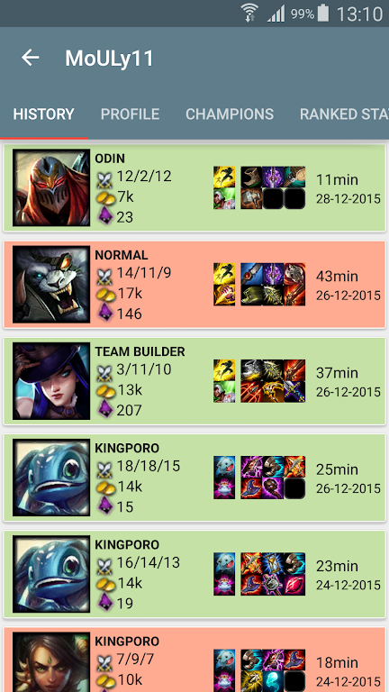
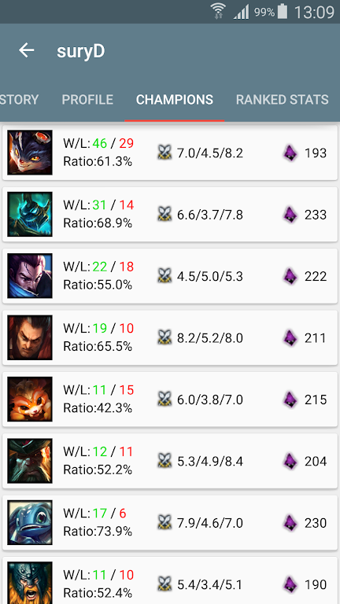
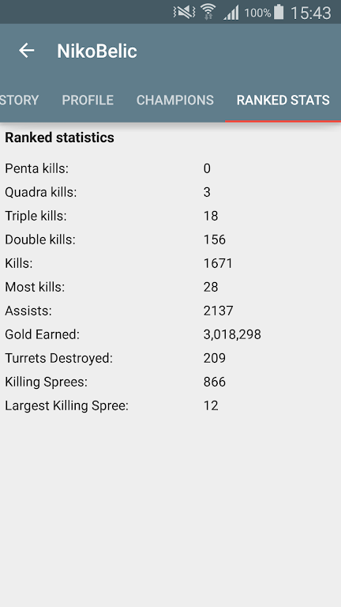

2015 side project. Android application for obtaining League of Legends player information from Riot API. Summoner profile, match history, active games and other info. See https://apkcombo.com/players-of-lol/com.pnapps.lolplayers/.

Players of LoL APP
This app allows you to find the following information:
*Active games
*Match history
*Summoner profile
*Free champion rotation

Supported regions:
NA, EUW, EUNE, LAN, LAS, OCE, RU.

If you like this app rate it, leave a comment and share with your friends. Any issues and suggestions can be sent to the email: pn74870@gmail.com.

This app isn't endorsed by Riot Games and doesn't reflect the views or opinions of Riot Games or anyone officially involved in producing or managing League of Legends. League of Legends and Riot Games are trademarks or registered trademarks of Riot Games, Inc. League of Legends © Riot Games, Inc.
